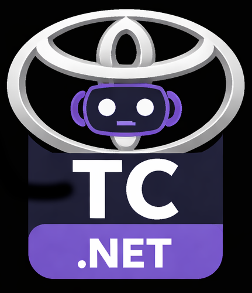

<div align="center">
  

# Posseth.Toyota.Client

[](https://www.nuget.org/packages/Posseth.Toyota.Client/)
[](LICENSE)
[](https://dotnet.microsoft.com/download)
[](https://docs.microsoft.com/en-us/dotnet/csharp/)

A modern .NET 10 client library for interacting with Toyota's MyToyota Connected Services API. This project provides a fluent, async-first interface to access comprehensive vehicle data including location, status, climate control, remote commands, and more.

</div>

## 📋 Table of Contents

- [Features](#features)
- [Installation](#installation)
- [Quick Start](#quick-start)
- [Dependency Injection](#dependency-injection)
- [Documentation](#documentation)
- [Contributing](#contributing)
- [License](#license)
- [Disclaimer](#disclaimer)

## ✨ Features

- **Async-First**: All operations are fully asynchronous with cancellation token support
- **Fluent Configuration**: Easy, chainable builder pattern for client setup
- **Dependency Injection**: First-class `IServiceCollection` integration via `AddToyotaClient()`
- **Type-Safe**: Strong typing for all API contracts and responses
- **Comprehensive API**: Access to vehicles, location, climate control, remote commands, trip history, and more
- **Token Caching**: Automatic token caching to minimize login overhead
- **Error Handling**: Precise exceptions for different failure scenarios
- **Performance**: Built with .NET 10 and C# 14 for optimal performance

## 📦 Installation

Install the NuGet package:

```bash
dotnet add package Posseth.Toyota.Client
```

Or via Package Manager:

```
Install-Package Posseth.Toyota.Client
```

## 🚀 Quick Start

```csharp
using Posseth.Toyota.Client;

// Create and configure the client
var client = new MyToyotaClient()
    .UseCredentials("your-username", "your-password")
    .UseTimeout(30)
    .UseTokenCaching(true);

// Authenticate
var loginSuccess = await client.LoginAsync();
if (!loginSuccess)
    throw new InvalidOperationException("Login failed");

// Get your vehicles
var vehicles = await client.GetVehiclesAsync();
foreach (var vehicle in vehicles?.Data ?? [])
{
    Console.WriteLine($"VIN: {vehicle.Vin}, Name: {vehicle.Nickname}");
}

// Get vehicle status
var location = await client.GetLocationAsync("JTHJP5C27D5012345");
Console.WriteLine($"Location: {location?.Data?.Latitude}, {location?.Data?.Longitude}");

// Control your vehicle
var result = await client.StartClimateControlAsync("JTHJP5C27D5012345");
if (result?.IsSuccess == true)
    Console.WriteLine("Climate control started");
```

## 💉 Dependency Injection

`Posseth.Toyota.Client` ships with built-in support for the [.NET Options pattern](https://learn.microsoft.com/dotnet/core/extensions/options) and `Microsoft.Extensions.DependencyInjection`.

### Option A — Inline lambda (recommended for simple setups)

```csharp
// Program.cs
using Posseth.Toyota.Client.Extensions;

builder.Services.AddToyotaClient(options =>
{
    options.Username       = builder.Configuration["Toyota:Username"]!;
    options.Password       = builder.Configuration["Toyota:Password"]!;
    options.TimeoutSeconds = 30;
    options.Logger         = msg => Console.WriteLine(msg); // optional
});
```

### Option B — Bind from `appsettings.json`

Add a section to your `appsettings.json`:

```json
{
  "ToyotaClient": {
    "Username": "your@email.com",
    "Password": "your-password",
    "TimeoutSeconds": 30,
    "UseTokenCaching": true
  }
}
```

Then register:

```csharp
// Program.cs
using Posseth.Toyota.Client;
using Posseth.Toyota.Client.Extensions;

builder.Services.AddToyotaClient(
    builder.Configuration.GetSection(ToyotaClientOptions.SectionName));
```

### Consuming `IMyToyotaClient`

Once registered, inject `IMyToyotaClient` anywhere in your application:

```csharp
public class VehicleService(IMyToyotaClient client)
{
    public async Task<string?> GetFirstVinAsync(CancellationToken ct = default)
    {
        await client.LoginAsync(ct);
        var vehicles = await client.GetVehiclesAsync(ct);
        return vehicles?.Data?.FirstOrDefault()?.Vin;
    }
}
```

> **Security tip:** Never store credentials in `appsettings.json` for production.  
> Use [Secret Manager](https://learn.microsoft.com/aspnet/core/security/app-secrets) in development  
> and [Azure Key Vault](https://learn.microsoft.com/azure/key-vault/general/overview) or environment variables in production.

For a full walkthrough see **[docs/GETTING_STARTED.md](docs/GETTING_STARTED.md)**.

## 📚 Documentation

- **[Getting Started](docs/GETTING_STARTED.md)** - Installation, configuration, DI setup, and common tasks
- **[API Reference](docs/API.md)** - Complete API documentation with examples
- **[Architecture](docs/ARCHITECTURE.md)** - Design overview and component details

## 📁 Project Structure

```
Posseth.Toyota.Client/
├── src/
│   └── Posseth.Toyota.Client/          # Main client library
│       ├── Extensions/                 # DI extension methods
│       ├── Interfaces/                 # Public API contracts
│       ├── Models/                     # API response/request models
│       ├── Services/                   # Core business logic
│       ├── Exceptions/                 # Custom exception types
│       └── ToyotaClientOptions.cs      # DI / Options-pattern configuration
├── samples/
│   └── Posseth.Toyota.Demo.ConsoleApp/ # Example usage
├── tests/
│   └── Posseth.Toyota.Client.Tests/    # Unit and integration tests
├── assets/
│   └── logo.svg                        # Project logo
└── docs/                               # Documentation
```

## 🛠️ Requirements

- **.NET 10+** or later
- **C# 14** (or later)
- **Toyota Connected Services Account**

## 🧪 Testing

To run the test suite:

```bash
# Unit tests
dotnet test

# With coverage (requires dotnet-coverage)
dotnet-coverage collect -f cobertura -o coverage.cobertura.xml dotnet test
```

### Environment Variables for Tests

Integration tests require valid Toyota credentials:

```bash
export TOYOTA_USERNAME=your-username
export TOYOTA_PASSWORD=your-password
dotnet test
```

## 🎯 Supported Features

### Vehicle Information
- Get all associated vehicles
- Get vehicle association details

### Electric/EV Status
- Battery level and charging status
- Real-time EV status data

### Climate Control
- Get climate settings and status
- Start/stop climate control
- Refresh climate status

### Remote Commands
- Lock/unlock vehicle
- Start/stop engine
- Control lights
- Open trunk
- Hazard lights

### Vehicle Telemetry
- Current location
- Lock status (doors, trunk, windows)
- Health diagnostics
- Telemetry data
- Service history
- Driving statistics and eco-scores

### Trip Management
- Trip history with optional route data
- Trip summaries
- Trip statistics

### Notifications
- Recent vehicle notifications

## 🔒 Security

- **Never hardcode credentials** - Use environment variables or configuration files
- **Token caching** is enabled by default but can be disabled if needed
- **Secure storage** - Consider using Azure Key Vault or similar for sensitive data in production
- See [SECURITY.md](SECURITY.md) for more details

## 🤝 Contributing

We welcome contributions! Please see [CONTRIBUTING.md](CONTRIBUTING.md) for guidelines.

## 📜 License

This project is licensed under the **MIT License** - see the [LICENSE](LICENSE) file for details.

Copyright © 2026 Michel Posseth (MPCoreDeveloper)

### Attribution

This project is based on [Abraham.MyToyotaClient](https://github.com/abraham/MyToyotaClient), which is licensed under the Apache License 2.0. We acknowledge and thank the original author for their work.

## ⚠️ Disclaimer

**This is an unofficial client library and is not affiliated with, endorsed by, or associated with Toyota Motor Corporation or any of its subsidiaries.**

Use at your own risk. The authors assume no responsibility for any misuse, damage, or issues arising from the use of this library. Ensure you comply with Toyota's Terms of Service and respect their API usage policies.

## 📞 Support

- 🐛 [Report Issues](https://github.com/MPCoreDeveloper/Posseth.Toyota.Client/issues)
- 💡 [Request Features](https://github.com/MPCoreDeveloper/Posseth.Toyota.Client/issues)
- 📖 [View Documentation](docs/)
- 📧 [Check Discussions](https://github.com/MPCoreDeveloper/Posseth.Toyota.Client/discussions)